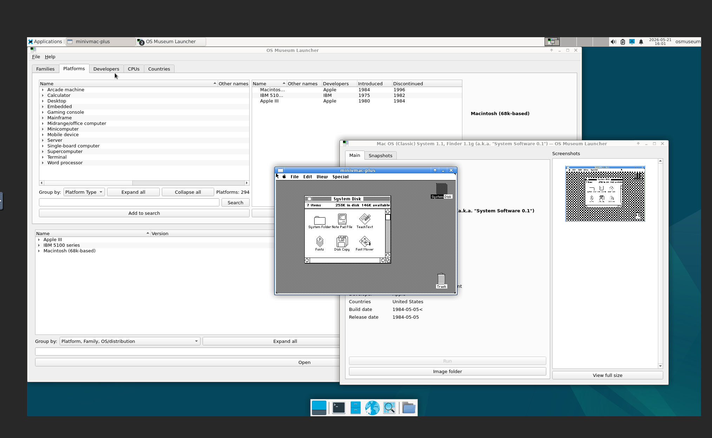

# virtualosmuseum-docker

Run the [Virtual OS Museum](https://virtualosmuseum.org) in a browser via Docker.

The Virtual OS Museum is a curated collection of 1,700+ pre-installed operating systems spanning the entire history of computing, from 1948 to the present day. This repo packages it as a Docker Compose stack with browser-based access via noVNC — no VirtualBox, no local QEMU install, no display server required.



## How it works

QEMU/KVM runs the museum's host Linux VM with its built-in VNC server. noVNC proxies that directly to your browser over WebSocket. Two processes, one container.

```
QEMU/KVM (museum VM) → built-in VNC :5901 → noVNC → browser
```

## Requirements

- Docker with Compose
- A CPU with KVM virtualization support (`/dev/kvm` must exist)
- For full nested virtualization support (running guest OSes inside the museum): AMD-V nested virt or Intel VT-x nested virt enabled
  - AMD: `cat /sys/module/kvm_amd/parameters/nested` should return `1`
  - Intel: `cat /sys/module/kvm_intel/parameters/nested` should return `Y`
- ~25GB free disk space for the lite edition (downloads guest OS images on demand)

## Setup

**1. Clone this repo**

```bash
git clone https://github.com/yourusername/virtualosmuseum-docker
cd virtualosmuseum-docker
```

**2. Download the Virtual OS Museum VM**

```bash
chmod +x setup-vm.sh
./setup-vm.sh /your/storage/path
```

This downloads the lite edition (~14GB) from Internet Archive and extracts it. The download is resumable if interrupted. The lite edition downloads individual guest OS disk images on first run — an internet connection is required the first time you launch each OS.

If you prefer the full offline edition (~121GB zipped), download it manually from [virtualosmuseum.org/downloads](https://virtualosmuseum.org/downloads) and extract it to the same path.

**3. Update the volume path in `compose.yaml`**

```yaml
volumes:
  - /your/storage/path:/vm   # update this line
```

**4. Build and start**

```bash
docker compose up -d --build
```

**5. Open in your browser**

```
http://your-host:8888
```

The museum launcher will appear. Double-click any OS to run it.

## Configuration

All tunables are environment variables in `compose.yaml`:

| Variable | Default | Description |
|---|---|---|
| `QEMU_RAM` | `8192` | RAM for the museum VM in MB |
| `QEMU_CPUS` | `4` | vCPUs for the museum VM |

The default values match the upstream VirtualBox configuration.

## Ports

| Port | Description |
|---|---|
| `8888` | noVNC browser UI |
| `8022` | SSH into the museum VM (username: `osmuseum`, password: `osmuseum`) |

## Troubleshooting

**Container starts but browser shows nothing**
Check QEMU logs: `docker logs virtualosmuseum`

**KVM not available**
Ensure `/dev/kvm` exists and is accessible. On Linux: `ls -la /dev/kvm`

**Guest OSes run slowly**
Nested virtualization may not be enabled. Check:
- AMD: `cat /sys/module/kvm_amd/parameters/nested`
- Intel: `cat /sys/module/kvm_intel/parameters/nested`

To enable on AMD (persistent):
```bash
echo "options kvm_amd nested=1" | sudo tee /etc/modprobe.d/kvm-amd.conf
```

**SSH into the museum VM**
```bash
ssh -p 8022 osmuseum@your-host   # password: osmuseum
```

## Notes

- This repo contains only the Docker wrapper. The Virtual OS Museum VM files are not included and must be downloaded separately per the above instructions.
- The museum VM and its contents are the work of [Andrew Warkentin](https://virtualosmuseum.org/about-the-curator). Please consider supporting the project on [Patreon](https://www.patreon.com/andreww591) or [Ko-fi](https://ko-fi.com/andreww591).
- Commercial OS images included in the museum are for historical research and preservation purposes only.

## License

The Docker wrapper files in this repo (Dockerfile, compose.yaml, start-qemu.sh, supervisord.conf, setup-vm.sh) are MIT licensed. The Virtual OS Museum itself is licensed under [CC BY-NC-SA 4.0](https://creativecommons.org/licenses/by-nc-sa/4.0/).
